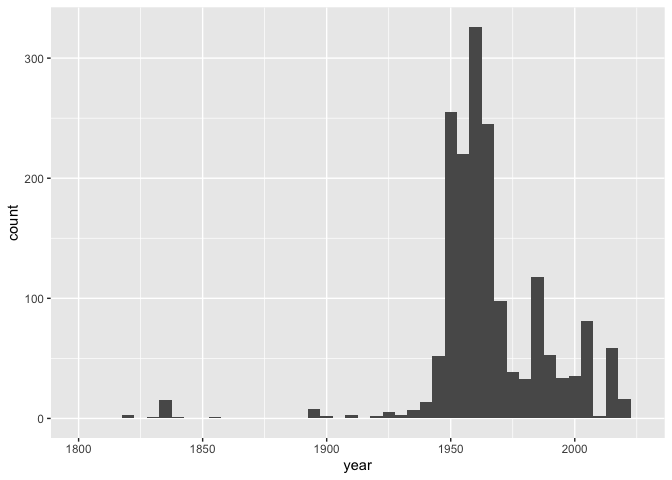

Lab 08 - University of Edinburgh Art Collection
================
Fiona Wang
03-04-2025

## Load Packages and Data

First, let’s load the necessary packages:

``` r
library(tidyverse) 
library(skimr)
library(scales)
```

Now, load the dataset. If your data isn’t ready yet, you can leave
`eval = FALSE` for now and update it when needed.

``` r
# Remove eval = FALSE or set it to TRUE once data is ready to be loaded
uoe_art <- read_csv("data/uoe-art.csv")
```

## Exercise 9

Let’s start working with the **title** column by separating the title
and the date:

``` r
uoe_art <- uoe_art %>%
  separate(title, into = c("title", "date"), sep = "\\(") %>%
  mutate(year = str_remove(date, "\\)") %>% as.numeric()) %>% 
  select(title, artist, year, link)  # Fill in the missing variable!
```

    ## Warning: Expected 2 pieces. Additional pieces discarded in 47 rows [16, 266, 459, 461,
    ## 508, 525, 564, 575, 592, 808, 873, 878, 920, 927, 1006, 1090, 1143, 1154, 1194,
    ## 1209, ...].

    ## Warning: Expected 2 pieces. Missing pieces filled with `NA` in 697 rows [7, 11, 12, 14,
    ## 25, 28, 38, 40, 43, 46, 50, 57, 58, 62, 64, 65, 67, 91, 95, 96, ...].

    ## Warning: There was 1 warning in `mutate()`.
    ## ℹ In argument: `year = str_remove(date, "\\)") %>% as.numeric()`.
    ## Caused by warning in `str_remove(date, "\\)") %>% as.numeric()`:
    ## ! NAs introduced by coercion

The warning message means that R didn’t identify a “)” in the title, so
they put NA in the year column for those instances.  
Some had month info which we don’t need. Using the as.numeric changed
those instances to NAs. We lost some information in this process.

## Exercise 10

``` r
uoe_art <- uoe_art %>% 
  mutate(artist = ifelse(artist == "Unknown", NA, artist))
```

Here, I changed the artist column. I observed that a lot of artists are
unknown, but they are written as unknown and not NA. I changed them into
NAs, so that the next question will have a more accurate answer.

## Exercise 11

``` r
skim(uoe_art)
```

|                                                  |         |
|:-------------------------------------------------|:--------|
| Name                                             | uoe_art |
| Number of rows                                   | 3312    |
| Number of columns                                | 4       |
| \_\_\_\_\_\_\_\_\_\_\_\_\_\_\_\_\_\_\_\_\_\_\_   |         |
| Column type frequency:                           |         |
| character                                        | 3       |
| numeric                                          | 1       |
| \_\_\_\_\_\_\_\_\_\_\_\_\_\_\_\_\_\_\_\_\_\_\_\_ |         |
| Group variables                                  | None    |

Data summary

**Variable type: character**

| skim_variable | n_missing | complete_rate | min | max | empty | n_unique | whitespace |
|:--------------|----------:|--------------:|----:|----:|------:|---------:|-----------:|
| title         |         0 |          1.00 |   0 |  95 |     5 |     1629 |          0 |
| artist        |       484 |          0.85 |   2 |  55 |     0 |     1197 |          0 |
| link          |         0 |          1.00 |  57 |  60 |     0 |     3312 |          0 |

**Variable type: numeric**

| skim_variable | n_missing | complete_rate |    mean |    sd |  p0 |  p25 |  p50 |  p75 | p100 | hist  |
|:--------------|----------:|--------------:|--------:|------:|----:|-----:|-----:|-----:|-----:|:------|
| year          |      1580 |          0.52 | 1964.56 | 53.22 |   2 | 1953 | 1962 | 1977 | 2020 | ▁▁▁▁▇ |

We are missing 484 pieces of artist info. We are missing 1580 pieces of
year info.

## Exercise 12

``` r
uoe_art %>% 
  ggplot(aes(x = year)) +
  geom_histogram(binwidth = 5) +
  scale_x_continuous(limits = c(1800, 2025))
```

    ## Warning: Removed 1581 rows containing non-finite outside the scale range
    ## (`stat_bin()`).

    ## Warning: Removed 2 rows containing missing values or values outside the scale range
    ## (`geom_bar()`).

<!-- -->

I don’t see anything unusual.
