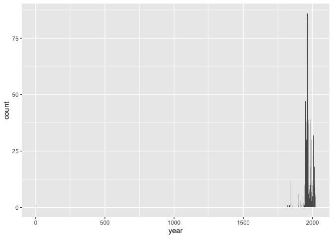
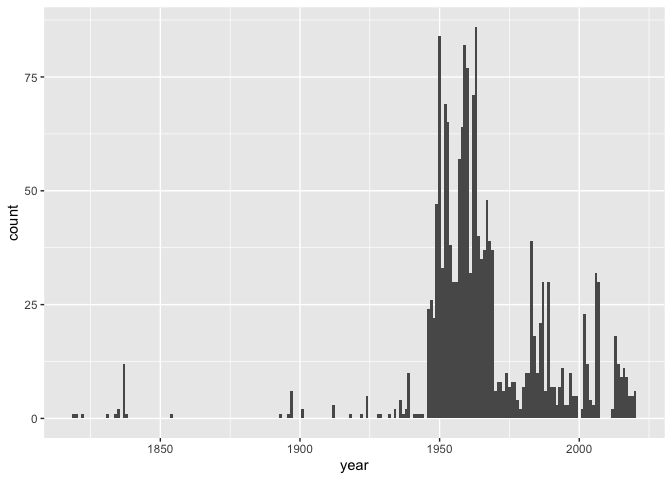

Lab 08 - University of Edinburgh Art Collection
================
Fiona Wang
03-04-2025

## Load Packages and Data

First, let’s load the necessary packages:

``` r
library(tidyverse) 
library(skimr)
library(scales)
```

Now, load the dataset. If your data isn’t ready yet, you can leave
`eval = FALSE` for now and update it when needed.

``` r
# Remove eval = FALSE or set it to TRUE once data is ready to be loaded
uoe_art <- read_csv("data/uoe-art.csv")
```

## Exercise 9

Let’s start working with the **title** column by separating the title
and the date:

``` r
uoe_art <- uoe_art %>%
  separate(title, into = c("title", "date"), sep = "\\(") %>%
  mutate(year = str_remove(date, "\\)") %>% as.numeric()) %>% 
  select(title, artist, year, link)  # Fill in the missing variable!
```

    ## Warning: Expected 2 pieces. Additional pieces discarded in 47 rows [16, 266, 459, 461,
    ## 508, 525, 564, 575, 592, 808, 873, 878, 920, 927, 1006, 1090, 1143, 1154, 1194,
    ## 1209, ...].

    ## Warning: Expected 2 pieces. Missing pieces filled with `NA` in 697 rows [7, 11, 12, 14,
    ## 25, 28, 38, 40, 43, 46, 50, 57, 58, 62, 64, 65, 67, 91, 95, 96, ...].

    ## Warning: There was 1 warning in `mutate()`.
    ## ℹ In argument: `year = str_remove(date, "\\)") %>% as.numeric()`.
    ## Caused by warning in `str_remove(date, "\\)") %>% as.numeric()`:
    ## ! NAs introduced by coercion

The warning message means that R didn’t identify a “)” in the title, so
they put NA in the year column for those instances.  
Some had month info which we don’t need. Using the as.numeric changed
those instances to NAs. We lost some information in this process.

## Exercise 10

``` r
uoe_art <- uoe_art %>% 
  mutate(artist = ifelse(artist == "Unknown", NA, artist))
```

Here, I changed the artist column. I observed that a lot of artists are
unknown, but they are written as unknown and not NA. I changed them into
NAs, so that the next question will have a more accurate answer.

## Exercise 11

``` r
skim(uoe_art)
```

|                                                  |         |
|:-------------------------------------------------|:--------|
| Name                                             | uoe_art |
| Number of rows                                   | 3312    |
| Number of columns                                | 4       |
| \_\_\_\_\_\_\_\_\_\_\_\_\_\_\_\_\_\_\_\_\_\_\_   |         |
| Column type frequency:                           |         |
| character                                        | 3       |
| numeric                                          | 1       |
| \_\_\_\_\_\_\_\_\_\_\_\_\_\_\_\_\_\_\_\_\_\_\_\_ |         |
| Group variables                                  | None    |

Data summary

**Variable type: character**

| skim_variable | n_missing | complete_rate | min | max | empty | n_unique | whitespace |
|:--------------|----------:|--------------:|----:|----:|------:|---------:|-----------:|
| title         |         0 |          1.00 |   0 |  95 |     5 |     1629 |          0 |
| artist        |       484 |          0.85 |   2 |  55 |     0 |     1197 |          0 |
| link          |         0 |          1.00 |  57 |  60 |     0 |     3312 |          0 |

**Variable type: numeric**

| skim_variable | n_missing | complete_rate |    mean |    sd |  p0 |  p25 |  p50 |  p75 | p100 | hist  |
|:--------------|----------:|--------------:|--------:|------:|----:|-----:|-----:|-----:|-----:|:------|
| year          |      1580 |          0.52 | 1964.56 | 53.22 |   2 | 1953 | 1962 | 1977 | 2020 | ▁▁▁▁▇ |

We are missing 484 pieces of artist info. We are missing 1580 pieces of
year info.

## Exercise 12

``` r
uoe_art %>% 
  ggplot(aes(x = year)) +
  geom_histogram(binwidth = 1) 
```

    ## Warning: Removed 1580 rows containing non-finite outside the scale range
    ## (`stat_bin()`).

<!-- -->

To be honest, I didn’t see anything unusual at first. Later, when
scrolling through the data frame, I realized that there is something
unusual. There is a year which is close to zero. On the graph here, it’s
almost invisible.

## Exercise 13

``` r
unusual <- uoe_art %>% 
  filter(year < 500)
```

We found the outlier. It is published in the year 2. Looking it up
online, the correct year is actually 1964. The title is Death Mask(2),
this parentheses is the reason why R coded this piece as year 2.

``` r
uoe_art <- uoe_art %>% 
  mutate(year = case_when(
    year == 2 ~ 1964,
    TRUE ~ year
  ))
```

``` r
uoe_art %>% 
  ggplot(aes(x = year)) +
  geom_histogram(binwidth = 1)
```

<!-- -->

## Exercise 14

``` r
uoe_art %>% 
  count(artist) %>% 
  arrange(desc(n))
```

    ## # A tibble: 1,198 × 2
    ##    artist                n
    ##    <chr>             <int>
    ##  1 <NA>                484
    ##  2 Emma Gillies        175
    ##  3 Ann F Ward           23
    ##  4 John Bellany         22
    ##  5 Zygmunt Bukowski     21
    ##  6 Boris Bućan          17
    ##  7 Marjorie Wallace     17
    ##  8 Gordon Bryce         16
    ##  9 William Gillon       16
    ## 10 Alan M. Alexander    14
    ## # ℹ 1,188 more rows

Apart from NAs, Emma Gillies appears the most commonly featured artist
in the collection. I don’t know this person. The way that the question
is asked, I would guess that this person is a professor or previous
student from this university.

## Exercise 15

``` r
uoe_art %>% 
  filter(str_detect(title, "child|Child"))
```

    ## # A tibble: 11 × 4
    ##    title                                                      artist  year link 
    ##    <chr>                                                      <chr>  <dbl> <chr>
    ##  1 "Untitled - Children Playing "                             Monik…  1963 http…
    ##  2 "Virgin and Child"                                         <NA>      NA http…
    ##  3 "Virgin and Child "                                        <NA>      NA http…
    ##  4 "Woman with Child and Still Life "                         Cathe…  1938 http…
    ##  5 "The Children's Hour "                                     Eduar…    NA http…
    ##  6 "Virgin and Child "                                        <NA>      NA http…
    ##  7 "Child's collar. Chinese"                                  <NA>      NA http…
    ##  8 "Child's chinese headdress"                                <NA>      NA http…
    ##  9 "Figure Composition with Nurse and Child, and Woman with … Edwar…    NA http…
    ## 10 "The Sun Dissolves while Man Looks Away from the Unborn C… Eduar…    NA http…
    ## 11 "Untitled - Portrait of a Woman and Child "                Willi…    NA http…

There are 11 pieces that have the word “child” in their title.
